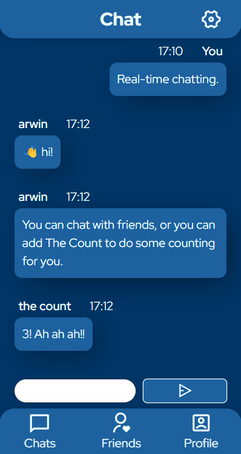

# Messaging app

#### A pretty, mobile-first, real-time chat app.

[

](screenshot1.png)

This is a frontend implementation of [The Odin Project's full stack _Messaging App_ project](https://www.theodinproject.com/lessons/nodejs-messaging-app).

As the penultimate project in The Odin Project's curriculum, it showcases a ton of what I've learned during the course.
On the frontend, those are things such as React Router, custom reusable React components, socket.io, extensive CSS and a lot of interfacing with [the app's API](https://github.com/arwin4/messaging-app-api).

## Some notable features

These are highlights of the frontend only. Check out [the app's backend here](https://github.com/arwin4/messaging-app-api).

- Real-time rendering of messages and of the chats the user is in, using socket.io
- React Router loaders and actions
- Fully keyboard-accessible, all color contrasts WCAG AA(A)
- Mobile first, but adapts to any screen size
- Buttons with busy states
- Error handling for forms
- Custom modals
- Minimal use of libraries

## Things I learned

- The more I'm able to "think in React", the less often I need of useState and useEffect.
- How to actually use React Router's loaders and actions to one's advantage (and when one shouldn't use them).
- How to create a protected route with React Router and how to combine that with my backend's authentication.
- How to use socket.io on the frontend and backend to reliably display new chat messages and update the chat and friend overviews in real-time.
- How to use the \<dialog> element properly.
- The :has() selector is amazing.
- Picking a pleasant and accessible color scheme is hard!
